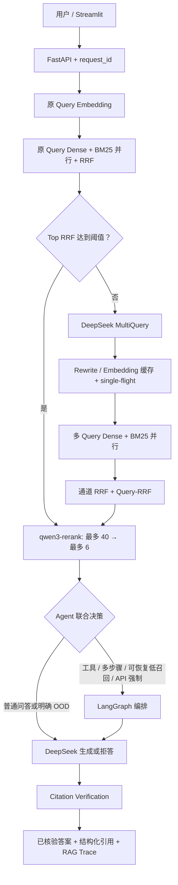

# 企业制度与员工手册助手

面向员工自助服务和 HR 制度查询的知识库助手。项目使用阿里云百炼 `text-embedding-v4` 完成制度文档向量化，通过自适应 Query 路由、Dense + BM25 多路召回、RRF 融合和 `qwen3-rerank` 重排筛选证据；DeepSeek 负责按需查询改写、答案生成和 Citation Verification。

演示语料说明见 [docs/data-sources.md](docs/data-sources.md)。

## 核心能力

- 员工手册、考勤休假、报销、信息安全、远程办公、绩效和入离职制度问答
- PDF、DOCX、PPTX、Markdown、TXT、HTML 文档摄取
- 阿里云百炼 `text-embedding-v4`，默认输出 1024 维向量；Chroma 本地持久化
- Retrieval-first Query 路由：所有 Query 先执行原始检索，召回不足再触发 MultiQuery
- 进程内 Query Rewrite / Query Embedding LRU 缓存与 single-flight 防击穿
- MultiQuery 批量 Embedding；多个 Query 的 Dense / BM25 通道由共享线程池并行执行
- 每个 Query 先做 Dense + BM25 RRF，再用 Query-RRF 稳定融合多个改写结果
- 真实调用百炼 `qwen3-rerank`：召回候选最多 40 个，重排后最多 6 个进入生成上下文
- `[S1] → chunk_id → 原文` 结构化引用，严格模式下先做 Citation Verification 再向用户输出答案
- 全链路 RAG Trace：Query 路由与改写、Dense/BM25/RRF/Rerank 排名、selected chunks、引用映射、核验结果、缓存命中、知识库/文档版本、Token 和阶段 span
- 区分生成模型首 Token、核验后用户可见首 Token 和 SSE 真正结束时间
- DeepSeek 调用重试、指数退避和进程内指标
- LangGraph Agent、计算器工具、SQLite 对话历史
- FastAPI SSE 接口、Streamlit 前端、Docker Compose、pytest 和 GitHub Actions

## 请求流程



详细设计见 [docs/architecture.md](docs/architecture.md)。

## 快速开始

环境要求：Python 3.11，以及可用的阿里云百炼和 DeepSeek API Key。Embedding 和 Rerank 可共用同一个已开通对应模型的 `DASHSCOPE_API_KEY`。

```bash
python3 -m venv .venv
source .venv/bin/activate
pip install -r requirements.txt
cp .env.example .env
```

在 `.env` 中填入自己的 Key：

```env
LLM_PRIMARY_PROVIDER=deepseek
LLM_FAST_PROVIDER=deepseek
LLM_FALLBACK_PROVIDER=deepseek

DEEPSEEK_API_KEY=sk-your-key
DEEPSEEK_BASE_URL=https://api.deepseek.com
DEEPSEEK_MODEL=deepseek-v4-flash

DASHSCOPE_API_KEY=sk-your-key
DASHSCOPE_BASE_URL=https://dashscope.aliyuncs.com/compatible-mode/v1
EMBEDDING_PROVIDER=dashscope
EMBEDDING_MODEL=text-embedding-v4
EMBEDDING_DIMENSION=1024
VECTORSTORE_COLLECTION=documents_v4_1024

ADAPTIVE_MULTIQUERY_ENABLED=true
QUERY_REWRITE_CACHE_SIZE=512
QUERY_EMBEDDING_CACHE_SIZE=512
SIMPLE_QUERY_MIN_RRF_SCORE=0.025
RETRIEVAL_PARALLEL_WORKERS=8

RERANKER_PROVIDER=qwen3
RERANKER_MODEL=qwen3-rerank
RERANKER_BASE_URL=https://dashscope.aliyuncs.com/compatible-api/v1
RERANKER_CANDIDATE_K=40
RERANKER_TOP_N=6
RERANKER_NOT_FOUND_THRESHOLD=0.30

TOP_K=6
CITATION_VERIFICATION_ENABLED=true
CITATION_VERIFICATION_STRICT=true
```

API Key 与阿里云地域、计费方案的 Base URL 必须匹配。不要提交 `.env`。

切换 Embedding 模型或维度后，旧向量不可复用，必须使用新的 Collection 并重新摄取全部文档。本项目默认使用 `documents_v4_1024`。Embedding 会把文档分块文本发送到阿里云百炼；敏感文档上线前应完成数据合规评估。

启动两个服务：

```bash
uvicorn app.api.main:app --host 0.0.0.0 --port 8000 --reload
streamlit run app/web/main.py
```

浏览器访问 `http://localhost:8501`，API 文档位于 `http://localhost:8000/docs`。

启动 API 后，一键导入 8 份虚构企业制度：

```bash
python scripts/ingest_demo_corpus.py
```

## Docker 部署

```bash
cp .env.example .env
# 编辑 .env 后启动
docker compose up --build
```

Chroma 数据和 SQLite 数据均通过卷持久化。

## 模型调用与引用核验

| 调用类型 | 触发时机 | 默认配置 |
|---|---|---|
| Query Rewrite | 模糊/多意图 Query，或精确 Query 首次召回不足 | DeepSeek，关闭 thinking，2 秒阶段预算 |
| Query / Document Embedding | 检索与文档摄取 | 阿里云 `text-embedding-v4`，在线查询 3 秒阶段预算 |
| Rerank | RRF 候选出现后 | 阿里云 `qwen3-rerank`，最多 40 输入 / 6 输出，4 秒后降级 RRF |
| 最终答案 | 有可用证据时 | DeepSeek，20 秒阶段预算 |
| 引用核验 | 生成完整答案后 | DeepSeek JSON 输出，关闭 thinking，5 秒后进入 `unverified` 策略 |

严格 Citation Verification 默认开启。系统会在输出前缓冲完整答案，校验引用编号、漏引结论以及结论与原文的一致性；核验失败或异常时执行 fail-closed，不展示未经验证的原答案。可通过 `CITATION_VERIFICATION_ENABLED` 和 `CITATION_VERIFICATION_STRICT` 调整。

`RERANKER_NOT_FOUND_THRESHOLD=0.30` 是基于当前演示语料和评测集的本地校准，只用于识别明显超出知识库的问题，不应未经重新评测就复用到其他数据集。Reranker 调用失败时保留 RRF 顺序并在 Trace 中标记 fallback，不会把降级分数误当成 Qwen 分数。

查看当前路由与指标：

```bash
curl http://localhost:8000/api/v1/models/status
```

该接口不会发起收费探测，只返回配置摘要、调用计数和最近一次 Rerank 元数据。

整条问答默认共享 30 秒总预算。每次重试只能使用当前阶段和整条请求的剩余时间，
不会把阶段超时按重试次数成倍放大。相同 Provider 连续失败 3 次后打开进程内
熔断器，30 秒恢复窗口后仅允许一个 half-open 探测请求；Reranker 熔断时直接
回退到 RRF，Citation Verification 超时或熔断时按严格模式 fail-closed。

相关环境变量：

```dotenv
QUERY_REWRITE_TIMEOUT_SECONDS=2
EMBEDDING_TIMEOUT_SECONDS=3
RERANKER_TIMEOUT_SECONDS=4
GENERATION_TIMEOUT_SECONDS=20
CITATION_VERIFICATION_TIMEOUT_SECONDS=5
REQUEST_TIMEOUT_SECONDS=30
CIRCUIT_BREAKER_FAILURE_THRESHOLD=3
CIRCUIT_BREAKER_RECOVERY_SECONDS=30
```

## 可观测性和延迟口径

每次问答生成可持久化的 RAG Trace。除完整检索排名和 `[S1] → chunk_id → 原文` 证据链外，Trace 还保存 `query_strategy`、`multiquery_triggered`、`multiquery_reason`、`cache_hits`、`cache_stats`、知识库版本、chunk 对应的文档版本、LLM/Reranker Token 和真实阶段 span。外部调用 span 会记录 `timeout_ms`、`retry_count`、`queue_time_ms`、`upstream_request_id`、`circuit_state` 和 `request_budget_remaining_ms`。Dense 与 BM25 的 span 可以重叠，用于验证并行执行，而不是伪造为串行耗时。

| 指标 | 含义 |
|---|---|
| `generation_ttft_ms` | 从生成模型调用开始到模型返回首 Token |
| `generation_first_token_at_ms` | 从整个 RAG 请求开始到生成模型首 Token |
| `verified_ttft_ms` | 从请求开始到 Citation Verification 完成 |
| `user_visible_ttft_ms` | 服务端首次准备/yield 用户可见答案 Token 的近似时间；严格核验模式下约等于核验完成时间，不包含完整的网络 flush |
| `client_user_visible_ttft_ms` | 性能脚本在客户端实际解析到首个非空答案 Token 的时间 |
| `sse_total_latency_ms` / `server_done_emit_ms` | 服务端终止事件准备完成的时间，不代表客户端已收到 |
| `client_done_latency_ms` | 性能脚本在客户端实际收到并解析 SSE `done` 的端到端时间 |

Web 端的“RAG 全流程追踪”可直接查看上述信息。旧字段 `ttft_ms` 仅为客户端兼容保留，语义与 `user_visible_ttft_ms` 一致。

## Agent 轻量路由

前端不再显示 Agent 按钮，统一由后端自动决策。每个 RAG 请求先用原始 Query
执行一次 Dense + BM25 检索，只有原始召回不足时才升级 MultiQuery。检索和
Rerank 的准备结果会被后续直接回答复用，不会为了路由再次执行一遍。

最终 Agent 决策同时考虑：

- 计算器、SQL 或数据库等工具调用；
- 明确比较两个对象的请求；
- 包含“先……然后……最后……”等明确顺序依赖的多步骤任务；
- 检索不足但仍有可恢复证据的查询；
- API 调用方显式传入 `enable_agent=true` 的请求。

如果 Reranker 已判断为明显 OOD/知识库无相关内容，普通查询直接执行拒答策略，
不会仅因为召回分数低就进入 Agent。

规则命中时会直接把确定的 `TaskPlan` 传给 Agent，跳过原先的 LLM 意图分类。
Trace 的 `api_total.attributes` 会记录 `agent_requested`、实际 `agent`、
`agent_intent` 和 `agent_route_reason`；Trace 本身还记录
`initial_retrieval_top_score`、`final_retrieval_top_score`、
`retrieval_quality`、`agent_decision` 和 `agent_reason`。

Query Rewrite 与 Query Embedding 缓存均使用 single-flight：并发相同 Query
只允许一个请求访问模型服务，其余请求等待并复用结果。等待次数记录在
`cache_stats.embedding_singleflight_waits` 和
`cache_stats.rewrite_singleflight_waits`。

## 文档摄取

```bash
curl -X POST http://localhost:8000/api/v1/ingest \
  -F "file=@tests/corpus/hr/星云科技员工手册.txt"
```

默认只允许 `pdf,docx,pptx,txt,md,html`，单文件最大 20MB，可通过环境变量修改。

## 测试与性能评测

不需要 API Key 的单元测试：

```bash
pip install -r requirements-dev.txt
pytest
python -m compileall -q app agent rag ingestion embeddings vectorstore models
```

端到端质量评测：

```bash
python tests/evaluate.py \
  --qa_file tests/qa_samples/all_qa.json \
  --output tests/results/evaluation.json
```

对已启动的 SSE 服务执行 50 次性能评测：

```bash
python tests/performance_benchmark.py \
  --qa-file tests/qa_samples/all_qa.json \
  --requests 50 \
  --concurrency 5 \
  --seed 42 \
  --endpoint optimized=http://127.0.0.1:8000 \
  --output tests/results/performance.json
```

与已保存的优化前报告比较：

```bash
python tests/performance_benchmark.py \
  --qa-file tests/qa_samples/all_qa.json \
  --requests 50 \
  --concurrency 5 \
  --seed 42 \
  --endpoint optimized=http://127.0.0.1:8000 \
  --baseline-report tests/results/performance_baseline_20260722.json \
  --output tests/results/performance_compare.json
```

脚本输出平均值、P50、P95、P99、三类 TTFT/SSE 耗时、LLM 与 Reranker Token、错误率、吞吐量、核验通过率和缓存 hit/miss 分组，并保留每次请求的原始记录。

### Regression Benchmark（固定 100 题）

`tests/benchmark/questions.json` 是固定的 Golden Dataset：95 条可回答问题覆盖
`tests/corpus/` 中的 19 份制度文档，另有 5 条知识库外问题用于检验拒答和幻觉。
标签使用由“来源文件名 + 标准化 chunk 原文”生成的 `stable_chunk_id`，因此重新入库后
Chroma UUID 改变也不会让期望结果失效。

每次修改检索、路由、Agent、Citation 或模型配置后，先运行固定 5 类冒烟：

```bash
python tests/smoke/smoke_test.py
```

冒烟覆盖 Direct RAG、文件引用、Calculator、明显 OOD 和可恢复低召回。
结果写入 `tests/smoke/results/smoke_report.json` 与 `smoke_report.md`。

先校验黄金集与版本化语料是否一致：

```bash
python tests/benchmark/validate_golden.py
```

启动 API 后执行固定 100 题，并自动与已保存 Baseline 对比：

```bash
python tests/benchmark/benchmark.py \
  --version v1.4 \
  --endpoint http://127.0.0.1:8000
```

`benchmark.py` 默认会先自动执行上述 5 类冒烟。任一用例失败时立即以状态码 1
退出，不会启动 100 问，也不会覆盖现有 Regression Report/Baseline。诊断脚本
本身时才可显式使用 `--skip-smoke`，日常回归和 CI 不应跳过。

结果写入：

- `tests/benchmark/results/regression_report.json`：完整逐题结果、Trace、环境与指标。
- `tests/benchmark/results/regression_report.md`：适合代码评审的摘要报告。

首次运行没有 Baseline 时，报告决策为 `NO_BASELINE`。确认结果有效后再显式提升，
避免一次异常运行覆盖基准：

```bash
python tests/benchmark/benchmark.py \
  --version v1.4 \
  --promote-baseline
```

以后修改代码后可启用回归门禁；超过
`tests/benchmark/regression_thresholds.json` 中的阈值会以状态码 2 退出：

```bash
python tests/benchmark/benchmark.py \
  --version v1.5 \
  --fail-on-regression
```

报告包含：

- 检索：pre-rerank 候选的 Recall@5、Recall@10、MRR、nDCG@10，以及 Rerank Recall@5。
- 延迟：端到端 Avg/P50/P95/P99、生成模型 TTFT、用户可见 TTFT。
- 生成：Citation Verification 通过率、Unsupported Claims、拒答准确率与幻觉率。
- 消耗：分阶段 Token 与 Embedding、Query Rewrite、Generation、Verification、Reranker 成本。

金额不会使用猜测价格。请先按阿里云百炼和 DeepSeek 当前账号/模型的实际计费，
填写 `tests/benchmark/pricing.json` 中的每百万 Token 单价；未配置的报告显示 `N/A`。
`generate_golden.py` 仅用于语料或标注策略变更时生成待评审候选，日常 Benchmark
绝不会自动改写黄金答案。生成后必须人工审查 diff 并再次运行校验脚本。

### 本地历史实测快照

条件：16 个唯一 QA 问题按固定种子调度，预热 1 次，正式请求 50 次，并发度 5，nearest-rank 分位数。完整原始报告仅保存在本地 `tests/results/`，避免在公开仓库中暴露逐请求 Trace 和完整证据文本。该次报告生成于最终 `RERANKER_NOT_FOUND_THRESHOLD=0.30` OOD 拒答补丁之前，50 次均记为 `answerable`；因此它是保守的历史性能回归基线，不代表最终拒答策略的最新质量结果。

| 指标 | 优化前 | 优化后实测（最终 OOD 补丁前） | 变化 |
|---|---:|---:|---:|
| 客户端 SSE 结束平均延迟 | 10418.93 ms | 5129.71 ms | -50.77% |
| P50 | 11739.59 ms | 4680.95 ms | -60.13% |
| P95 | 14655.18 ms | 7768.29 ms | -46.99% |
| P99 | 16192.00 ms | 26101.31 ms | +61.20% |
| 生成模型平均 TTFT | 1692.30 ms | 1654.22 ms | -2.25% |
| 平均 Citation Verification 完成时间 | 10355.42 ms | 5073.36 ms | -51.01% |
| 平均用户可见 TTFT | 10358.52 ms | 5077.74 ms | -50.98% |
| 平均 DeepSeek Token | 2492.88 | 1850.70 | -25.76% |
| 平均 Reranker Token | 0 | 3444.58 | 新增重排调用 |
| 技术错误率 | 0% | 0% | 持平 |
| Citation Verification 通过率 | 34% | 74% | +40 个百分点 |
| 成功吞吐量 | 0.4537 req/s | 0.9349 req/s | +106.06% |

这是本地单次实测快照，不是生产 SLA。50 个样本下 nearest-rank P99 就是最大值，当前结果受一次 26.1 s 异常点影响，因此 P99 并未改善；稳定评估 P99 建议至少执行 100 次并重复多轮。当前 37/50 回答通过 Citation Verification，其余 13 次按严格策略关闭输出，不等同于 HTTP/服务技术错误。Reranker Token 是新增模型输入，与 DeepSeek Token 的计费口径不可直接等价比较。

## 主要 API

| 方法 | 路径 | 说明 |
|---|---|---|
| GET | `/health` | 服务就绪状态 |
| GET | `/api/v1/models/status` | 模型路由与调用指标 |
| POST | `/api/v1/chat` | 普通问答 |
| POST | `/api/v1/chat/stream` | SSE 流式问答 |
| POST | `/api/v1/ingest` | 上传并摄取文档 |
| GET | `/api/v1/documents` | 文档列表 |
| DELETE | `/api/v1/documents/{doc_id}` | 删除文档 |
| GET | `/api/v1/stats` | 知识库统计 |

## 当前边界

- 这是单机作品集项目，没有实现企业级租户隔离和 RBAC。
- Query Rewrite 和 Query Embedding 缓存位于单进程内存，重启后清空，多副本之间不共享。
- SQLite 和本地 Chroma 适合演示及中小数据量；大规模部署需要进一步设计独立数据库、向量服务、分布式缓存和可观测平台。
- 项目自带虚构公司“星云科技”的合成制度语料，不包含真实员工或企业数据，也不构成法律意见。

简历描述与面试讲解要点见 [docs/resume.md](docs/resume.md)。
