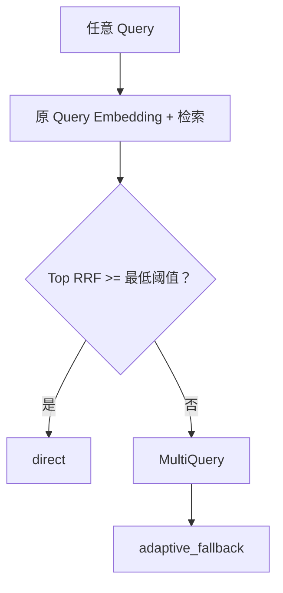

# 架构与关键决策

## 组件边界

- `app/api`：HTTP/SSE 契约、上传约束、应用生命周期、模型状态和请求级指标。
- `app/web`：Streamlit 展示层，通过 HTTP 调用后端，展示答案、引用和 RAG Trace。
- `ingestion`：Loader、分块、文档 Embedding、chunk 元数据与向量写入。
- `embeddings`：阿里云百炼 Embedding 客户端，负责批处理、重试和响应顺序/维度校验。
- `vectorstore`：Chroma 向量检索与持久化。
- `rag/retrievers`：Dense、BM25、通道 RRF 和并行调度。
- `rag/chains`：Retrieval-first、MultiQuery、缓存/single-flight、多 Query 融合、Rerank、上下文组装、生成和 Trace 汇总。
- `rag/post_processors`：`qwen3-rerank` 调用与 Citation Verification。
- `agent`：意图识别、任务规划与受控工具调用。
- `models`：Pydantic 数据契约、RAG Trace 结构和 SQLite 持久化。

## 自适应 Query 路由

路由策略的目标是先用真实召回结果判断是否值得支付 LLM Query Rewrite 延迟，
而不是根据问题表述预判所有模糊问题都需要改写。

当前规则与 Trace 语义：

| 情况 | `query_strategy` | `multiquery_reason` |
|---|---|---|
| 任意 Query 且原 Query 召回足够 | `direct` | `original_retrieval_sufficient` |
| 任意 Query 首次召回不足 | `adaptive_fallback` | `original_retrieval_insufficient` |
| 禁用自适应 MultiQuery 且召回不足 | `direct` | `multiquery_disabled` |
| 工具/多步骤/API 强制 Agent 已明确升级 | `direct` | `agent_intent_skips_multiquery` |

“召回足够”当前使用原 Query Top-1 RRF 分数与 `SIMPLE_QUERY_MIN_RRF_SCORE` 比较。这个阈值是可配置启发式，应用新语料时需用召回评测集重新校准，不等同于普适置信度。

## Query 缓存

RAG Chain 维护两个独立的有界 LRU 缓存：

1. Query Rewrite 缓存：Key 包含规范化 Query、改写数量和版本标记；只缓存至少成功产生一个变体的结果，不缓存短暂 API 失败。
2. Query Embedding 缓存：Key 由 Embedding 模型名、维度和规范化 Query 组成；只服务于在线 Query，文档摄取不会读写该缓存。

两个缓存均加入进程内 single-flight。并发相同 Key 只有 leader 请求上游，
其余请求等待并复用相同结果，避免缓存冷启动时击穿。缓存命中、未命中和
single-flight 等待数量写入 `cache_hits`、`cache_stats` 及相应 span 属性。
当前仍是单进程内存实现：重启即丢失，多 worker/多副本不共享；多副本部署时
应迁移为 Redis 等共享缓存和分布式锁。

## Retrieval-first 与 Agent 边界

RAG Chain 的 `prepare()` 先完成原始检索、必要的 MultiQuery 和 Rerank，并把结果
同时交给路由与直接回答复用。前端不提供 Agent 开关。后端按以下信号决定是否
进入 LangGraph：

- 检索为 `recoverable_low` 或 `low_confidence`；
- 规则识别为工具调用、明确对比或多步骤任务；
- API 调用方显式设置 `enable_agent=true`。

如果 Reranker 判断为 `not_found`，且没有工具、多步骤或显式强制信号，则直接
走知识库拒答，不把 OOD 问题交给 Agent。LangGraph 只负责升级后的任务编排，
不负责替代检索层判断是否需要扩展召回。

## 并行多路召回与 RRF

MultiQuery 返回原 Query 和最多 3 个改写变体。缓存未命中的 Query Embedding 在一次批调用中生成；检索阶段则使用共享 `ThreadPoolExecutor`，为每个 Query 同时提交 Dense 和 BM25 任务。因此并行优化主要体现在多 Query 的 Dense/BM25 通道，而不是多次并行 Embedding HTTP 请求。

融合分两层：

1. 通道 RRF：对每个 Query 的 Dense 排名与 BM25 排名做 RRF，`k=60`。
2. Query-RRF：对不同 Query 的第一层 RRF 榜单再融合，使用 `chunk_id` 去重，相同分数以稳定 ID 排序，避免“先完成的任务优先”。

一个请求内固定 BM25 快照引用，避免摄取热更新时不同改写 Query 读到不同 BM25 版本。Dense 和 BM25 的真实开始时间、耗时和原始排名都写入 Trace，多个 span 可以时间重叠。

## qwen3-rerank

RRF 融合后取最多 `RERANKER_CANDIDATE_K=40` 个候选，通过阿里云百炼 `/reranks` 接口调用 `qwen3-rerank`，最终保留 `min(request.top_k, RERANKER_TOP_N)` 个，默认最多 6 个供 DeepSeek 生成。

Reranker 元数据包括 provider、model、request ID、候选数、输出数、Token 用量、fallback 和 error，通过 `rerank` span 及 `/api/v1/models/status` 暴露。客户端重试耗尽时使用 NoOp 降级，保留 RRF 顺序。

`RERANKER_NOT_FOUND_THRESHOLD=0.50` 用于将明显低相关的结果改为 `not_found`。该值来自当前本地语料与 calibration 分片的校准；降级时不使用该规则，避免把 RRF 分数误当成 Qwen 相关性分数。

## 子问题证据覆盖

只有包含明确比较、分别、多条件或多个问句的 Query 才进入该路径。快速规划器输出最多 4 个保持原条件的原子子问题；它们共享一次批量 Embedding，并行执行 Dense/BM25 检索和独立 Qwen Rerank。选择器先覆盖每个非 `not_found` 子问题，再按相关分数补充候选，并限制单一来源对剩余上下文的占用。相同制度存在多个版本时只保留检索候选中的最新版本。

每个分支在 Trace 中记录 `subquestion_id`、独立状态、选中 Chunk、稳定 Chunk ID、来源和 Top Rerank 分数。部分分支无证据时整体状态为 `partially_answerable`，生成器只回答有证据分支，并明确列出暂无法确认的子问题。普通 Query 不经过该阶段。

## 结构化引用与 Citation Verification

进入 Prompt 的 chunk 会获得 `[S1]`、`[S2]` 等本次请求内的引用号。`Citation` 结构同时保存：

- `citation_id`：例如 `S1`。
- `chunk_id`：向量库中的稳定 chunk 标识。
- 原文、来源文件、页码/分块信息和文档版本。

生成完成后，先过滤答案未使用的引用，再让 Citation Verifier 检查引用号有效性、重要结论是否漏引，以及结论是否被对应原文支持。复合问题中的每条结论还必须绑定有效的 `subquestion_id`，不能把 `not_found` 分支判为有证据支持。核验调用要求 JSON 输出并关闭 thinking，减少截断或非结构化响应。

严格模式下，服务端缓冲完整生成结果，核验通过后才向用户发送；普通回答核验失败或异常时 fail-closed。`partially_answerable` 中若同时存在已支持和未支持结论，只删除未支持结论并保留已核验分支；`not_found` 不调用答案生成，引用核验记为 skipped。

## Trace 与时延口径

每个 HTTP 请求生成或透传 `X-Request-ID`。`RAGTrace` 保存：

- Query 改写结果、路由策略、MultiQuery 触发原因和缓存命中。
- Dense / BM25 原始排名、每路 RRF、多 Query 融合结果和 Qwen Rerank 分数。
- `selected_chunk_ids`、子问题状态与 Evidence Coverage、`citation_map`、逐结论 Citation Verification 结果。
- `knowledge_base_version` 和命中 chunk 的 `document_versions`。
- 原始检索、改写、Embedding、Dense/BM25、Rerank、Agent 决策、上下文、生成和核验 span。
- DeepSeek prompt/completion Token、Reranker Token 和汇总 Token。

时延不使用一个“TTFT”混合表示：

| 字段 | 起点 | 终点 |
|---|---|---|
| `generation_ttft_ms` | 生成模型调用开始 | 模型首 Token |
| `generation_first_token_at_ms` | RAG 请求开始 | 模型首 Token |
| `verified_ttft_ms` | RAG 请求开始 | Citation Verification 完成 |
| `user_visible_ttft_ms` | RAG 请求开始 | 服务端首次准备/yield 用户可见 Token（近似值） |
| `client_user_visible_ttft_ms` | 性能客户端开始请求 | 客户端实际解析到首个非空答案 Token |
| `sse_total_latency_ms` | RAG 请求开始 | 服务端 SSE 终止事件准备完成 |
| `client_done_latency_ms` | 性能客户端开始请求 | 客户端实际收到 SSE `done` |

严格核验下，`generation_ttft_ms` 可以很小，但答案还要等完整生成和 Citation Verification，因此必须同时观察 `user_visible_ttft_ms`。该服务端值只表示准备/yield 时间，不包含完整网络 flush；要衡量真正的客户端感知，应使用性能脚本的 `client_user_visible_ttft_ms` 和 `client_done_latency_ms`。旧 `ttft_ms` 只为兼容保留，语义等同服务端用户可见 TTFT。

## 性能评测方法

`tests/performance_benchmark.py` 直接消费 SSE 事件，不只读服务端的自报指标。它支持 50–100 次固定种子调度、预热、有限并发、多端点或历史 baseline 对比，输出：

- 客户端端到端延迟与服务端延迟的平均值、P50、P95、P99、最小值和最大值。
- 生成 TTFT、核验完成时间和用户可见 TTFT。
- LLM/Reranker Token、技术错误率、可观测完整率、核验通过率和 RPS。
- Query Rewrite / Embedding 缓存命中分组与每次原始请求记录。

当前保存的 50 次、并发度 5 历史快照中，客户端 SSE 结束平均延迟从 10.42 s 降至 5.13 s，P95 从 14.66 s 降至 7.77 s，DeepSeek 平均 Token 降低 25.76%，技术错误率为 0%。P99 由于一次 26.1 s 异常点反而上升，不应隐藏。该报告在当前校准后的 `RERANKER_NOT_FOUND_THRESHOLD=0.50` OOD 拒答策略前生成，50 次均记为 `answerable`，因此是保守的历史回归基线，不是最新拒答质量结果。完整条件、数据和限制见 [README 的性能评测章节](../README.md#测试与性能评测) 与 [原始 JSON](../tests/results/performance_final_20260722.json)。

## 多模型路由

`ResilientLLMClient` 对 RAG 和 Agent 暴露统一的 `generate` / `generate_stream` 接口，业务层不依赖具体厂商。短输出调用走 fast provider，正式答案走 primary provider；调用使用指数退避重试，耗尽后才切换 fallback。Query Rewrite 和 Citation Verification 显式关闭 thinking，后者还要求 JSON Object 输出。

## 数据安全

- Key 仅从 `.env` 或环境变量读取，`.env` 被 Git 忽略。
- 上传在解析前检查扩展名和大小，临时文件最终清理。
- Query 使用 Pydantic 限制长度和 `top_k`。
- Calculator 使用 AST 白名单，而不是 `eval`。
- CORS 默认只允许本机 Streamlit。
- Embedding 文本会发送给阿里云百炼，生成上下文会发送给 DeepSeek；敏感数据上线前需完成合规评估。

## 已知取舍

- 进程内指标和缓存在重启后清零；生产系统应接入 Prometheus/OpenTelemetry 和分布式缓存。
- 检索并行度由共享线程池上限控制，默认 8；高并发场景仍需队列、背压、超时预算和资源隔离。
- 严格 Citation Verification 提高输出安全性，但必然增加用户可见 TTFT；应根据场景在延迟和 fail-closed 之间做选择。
- `qwen3-rerank` 改善证据排序并减少 DeepSeek 上下文，但增加一次外部调用和 Reranker Token。
- Embedding 模型或维度变化会改变向量空间，必须创建新 Collection 并重新摄取文档。
- SQLite 和本地 Chroma 为单机演示选择，当前没有租户隔离、RBAC 或跨节点一致性保证。
